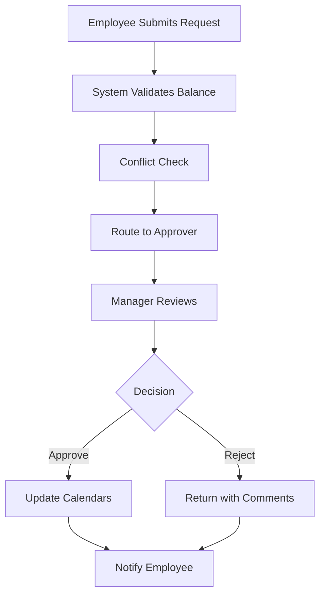

# CADEBECK HR Management System - Product Requirements Document

**Version:** 1.1  
**Date:** July 22, 2025  
**Client:** Antonio Napoli, Director - a.napoli@cadebeck.tech  
**Developer:** Cynthia Nderitu  

---

## 1. Executive Summary

### 1.1 Product Vision
The CADEBECK HR Management System is a comprehensive web-based platform designed to transform HR operations from manual, paper-based processes to a streamlined digital ecosystem. The system serves as a single source of truth for all employee-related data and processes, from initial onboarding through ongoing performance management and payroll processing.

### 1.2 Business Problem
CADEBECK currently manages HR processes manually, leading to:
- Inefficient time allocation (60%+ spent on administrative tasks)
- Compliance risks with Revenue Authority requirements
- Poor employee experience due to lengthy manual processes
- Lack of visibility into workforce analytics and well-being
- Difficulty managing multilingual workforce needs

### 1.3 Solution Overview
A bilingual, role-based HR management platform that automates core HR functions while providing self-service capabilities for employees and comprehensive analytics for management.

### 1.4 Key Success Metrics
| Metric | Current State | Target State | Timeline |
|--------|---------------|--------------|----------|
| Manual HR processing time | 100% | 40% | 3 months |
| Compliance accuracy | ~80% | 100% | 3 months |
| Employee self-service adoption | 0% | >80% | 6 months |
| System uptime | N/A | >99.5% | Ongoing |

---

## 2. Project Scope & Phases

### 2.1 Current Status
**Phase 1** (Partially Completed):
- ✅ Core authentication system
- ✅ Basic employee management
- ✅ Role-based access control
- ✅ Responsive navigation
- 🔄 Document upload system (in progress)

### 2.2 Phase 2 Scope (This PRD)
**Duration:** 2-3 weeks
- Leave & absence management
- Comprehensive payroll system with external integration
- Employee stress monitoring & well-being tracking
- Enhanced admin interface and reporting
- Complete bilingual support implementation

### 2.3 Future Phases (Out of Scope)
- Mobile application development
- Advanced analytics and AI insights
- Multi-company/tenant support
- Third-party HR system integrations (beyond payroll)

---

## 3. Target Users & Use Cases

### 3.1 Primary User Personas

#### 3.1.1 Super Administrator
**Profile:** Technical lead or system administrator
**Primary Goals:** 
- Maintain system integrity and security
- Configure organizational settings
- Manage user access and permissions

**Key Pain Points:**
- Need centralized control over system configuration
- Require visibility into system performance and usage
- Must ensure data security and compliance

#### 3.1.2 HR Administrator
**Profile:** HR manager or senior HR staff
**Primary Goals:**
- Streamline employee lifecycle management
- Ensure compliance with regulations
- Improve employee experience and engagement

**Key Pain Points:**
- Manual processes consume excessive time
- Difficulty tracking compliance requirements
- Limited visibility into employee well-being
- Challenges managing multilingual workforce

#### 3.1.3 Employee
**Profile:** All company staff members
**Primary Goals:**
- Easy access to personal HR information
- Self-service for common requests
- Transparent view of benefits and compensation

**Key Pain Points:**
- Time-consuming manual request processes
- Lack of visibility into leave balances and payroll
- Language barriers in HR communications
- Limited feedback channels for workplace concerns

---

## 4. User Roles & Permissions Matrix

| Feature Area | Super Admin | HR Admin | Employee |
|-------------|-------------|----------|----------|
| **System Configuration** | ✅ Full Access | ❌ None | ❌ None |
| **User Management** | ✅ All Users | ✅ Employees Only | ❌ None |
| **Employee Data** | ✅ All Employees | ✅ All Employees | ✅ Own Data Only |
| **Leave Management** | ✅ All Requests | ✅ Approve/Manage | ✅ Submit/View Own |
| **Payroll Processing** | ✅ All Functions | ✅ Process/Generate | ❌ None |
| **Payslip Access** | ✅ All Payslips | ✅ All Payslips | ✅ Own Payslips |
| **Stress Monitoring** | ✅ All Data | ✅ Aggregate Reports | ✅ Own Responses |
| **Reporting** | ✅ All Reports | ✅ HR Reports | ✅ Personal Reports |
| **Language Settings** | ✅ System-wide | ✅ Department | ✅ Personal |

---

## 5. User Stories & Acceptance Criteria

### 5.1 Leave Management Stories

#### US-LM-001: Employee Leave Request
**As an employee, I want to request leave online so that I can manage my time off without manual paperwork.**

**Acceptance Criteria:**
- [ ] Employee can select from all available leave types
- [ ] System validates leave balance before submission
- [ ] Calendar integration shows potential conflicts
- [ ] Automatic email notifications sent to approvers
- [ ] Request status is visible to employee in real-time
- [ ] All forms available in both supported languages

#### US-LM-002: Manager Leave Approval
**As an HR administrator, I want to approve/reject leave requests so that I can maintain adequate staffing levels.**

**Acceptance Criteria:**
- [ ] Pending requests appear in prioritized dashboard
- [ ] Team calendar shows impact of approved requests
- [ ] One-click approval/rejection with optional comments
- [ ] Automated notifications to employee upon decision
- [ ] Ability to set delegate approvers during absence

### 5.2 Payroll Management Stories

#### US-PR-001: Payroll Processing
**As an HR administrator, I want to process monthly payroll so that employees are paid accurately and on time.**

**Acceptance Criteria:**
- [ ] Import attendance data for calculations
- [ ] Automated PAYE tax calculations per RA requirements
- [ ] Support for multiple allowance and deduction types
- [ ] Bulk payslip generation with company branding
- [ ] One-click bank file generation for transfers
- [ ] Comprehensive audit trail for all changes

#### US-PR-002: External Payroll Integration
**As an HR administrator, I want to import payslips from external systems so that employees have unified access to all compensation information.**

**Acceptance Criteria:**
- [ ] Support CSV/Excel import with field mapping
- [ ] Data validation to prevent duplicate entries
- [ ] Merge external data with internal payroll records
- [ ] Unified employee view of all payslip sources
- [ ] Maintain separate audit trails for external data

### 5.3 Well-being Monitoring Stories

#### US-WB-001: Stress Assessment
**As an employee, I want to complete anonymous stress surveys so that I can contribute to workplace wellness improvements.**

**Acceptance Criteria:**
- [ ] Anonymous survey completion (no personal identifiers stored)
- [ ] Surveys available in both supported languages
- [ ] Progress indicators during survey completion
- [ ] Optional feedback text fields
- [ ] Confirmation message upon successful submission

#### US-WB-002: Well-being Analytics
**As an HR administrator, I want to view stress analytics so that I can identify and address workplace wellness issues.**

**Acceptance Criteria:**
- [ ] Aggregate stress level trends by department/time period
- [ ] Alert system for departments exceeding stress thresholds
- [ ] Individual employee risk indicators (anonymized)
- [ ] Correlation analysis with attendance and performance data
- [ ] Exportable reports for management presentation

---

## 6. Detailed Functional Requirements

### 6.1 Leave & Absence Management

#### 6.1.1 Leave Request Workflow


#### 6.1.2 Leave Types Configuration
| Leave Type | Annual Entitlement | Carryover Rules | Advance Allowed |
|------------|-------------------|------------------|-----------------|
| Annual Leave | [TODO: Clarify] days | [TODO: Clarify] | Yes |
| Sick Leave | [TODO: Clarify] days | No | No |
| Maternity Leave | 90 days | No | No |
| Paternity Leave | 14 days | No | No |
| Compassionate Leave | 7 days | No | Yes |

#### 6.1.3 Attendance Tracking Features
- **Clock-in/Clock-out:** Web-based with IP restriction options
- **Late Arrival Threshold:** [TODO: Clarify minutes] after scheduled start
- **Overtime Rules:** [TODO: Clarify overtime calculation method]
- **Break Time Tracking:** Optional feature for detailed time management

### 6.2 Payroll System Architecture

#### 6.2.1 Calculation Engine Components
1. **Base Salary Processing**
   - Monthly, bi-weekly, or weekly pay cycles
   - Pro-rata calculations for partial months
   - Currency formatting in KES

2. **Allowances Management**
   - Housing allowance
   - Transport allowance
   - Medical allowance
   - Custom allowance types

3. **Deductions Processing**
   - PAYE tax (Revenue Authority compliant)
   - NSSF contributions
   - NHIF contributions
   - Loan deductions
   - Custom deduction types

#### 6.2.2 External Payroll Integration Specifications
```json
{
  "import_format": {
    "supported_formats": ["CSV", "Excel", "JSON"],
    "required_fields": ["employee_id", "pay_period", "gross_pay"],
    "optional_fields": ["allowances", "deductions", "net_pay"],
    "validation_rules": {
      "employee_id": "Must exist in system",
      "pay_period": "YYYY-MM format",
      "amounts": "Numeric, positive values"
    }
  }
}
```

### 6.3 Stress Monitoring & Analytics

#### 6.3.1 Survey Design Framework
- **Frequency:** Monthly pulse surveys, quarterly comprehensive assessments
- **Question Types:** Likert scale, multiple choice, open text
- **Areas Covered:** Workload, work-life balance, management support, career development
- **Anonymization:** No personal identifiers stored with responses

#### 6.3.2 Analytics Dashboard Components
1. **Department Stress Heatmap**
   - Color-coded visualization by stress level
   - Trend analysis over time
   - Comparative metrics across departments

2. **Early Warning System**
   - Automated alerts when department stress exceeds threshold
   - Individual risk indicators based on multiple data points
   - Recommended intervention strategies

---

## 7. Technical Specifications

### 7.1 Technology Stack
| Component | Technology | Version |
|-----------|------------|---------|
| Backend Framework | Laravel | 10+ (upgradeable to 12+) |
| Authentication | Laravel Jetstream | Latest |
| Authorization | Spatie Laravel-Permission | Latest |
| Frontend | Livewire 3 or React.js | Latest |
| Styling | Tailwind CSS | 3.x |
| Database | MySQL | 8.0+ |
| PDF Generation | Laravel-DomPDF | Latest |
| Localization | Laravel Lang | Latest |

### 7.2 Database Schema Highlights

#### 7.2.1 Core Tables
```sql
-- Simplified schema representation
employees (id, employee_number, name, email, department_id, ...)
leave_requests (id, employee_id, leave_type, start_date, end_date, status, ...)
payroll_records (id, employee_id, pay_period, gross_pay, deductions, net_pay, ...)
external_payslips (id, employee_id, source_system, import_date, data, ...)
stress_responses (id, survey_id, response_data, submitted_at, ...)
```

#### 7.2.2 Localization Support
- Separate translation tables for all user-facing content
- Fallback mechanism to default language (English)
- Dynamic locale switching without page reload

### 7.3 Performance Requirements
| Metric | Target | Measurement Method |
|--------|--------|-------------------|
| Page Load Time | <3 seconds | 95th percentile |
| Database Query Time | <500ms | Average response time |
| Concurrent Users | 100+ | Load testing |
| API Response Time | <1 second | Average response time |
| File Upload Speed | 1MB in <10 seconds | Average upload time |

### 7.4 Security Implementation

#### 7.4.1 Authentication & Authorization
- Multi-factor authentication (optional)
- Password complexity requirements
- Session timeout management
- Role-based access control (RBAC)

#### 7.4.2 Data Protection
- Encryption at rest for sensitive data
- HTTPS enforcement
- CSRF protection on all forms
- XSS prevention through input sanitization
- SQL injection prevention through ORM

---

## 8. Non-Functional Requirements

### 8.1 Scalability Requirements
- **User Growth:** Support 500+ users within 24 months
- **Data Volume:** Handle 10+ years of historical data
- **Geographic Distribution:** Single timezone (EAT) initially
- **Module Expansion:** Architecture supports additional HR modules

### 8.2 Reliability & Availability
- **Uptime Target:** 99.5% excluding planned maintenance
- **Recovery Time Objective (RTO):** 4 hours
- **Recovery Point Objective (RPO):** 24 hours
- **Backup Strategy:** Daily automated backups with 30-day retention

### 8.3 Usability Standards
- **Accessibility:** WCAG 2.1 AA compliance
- **Mobile Responsiveness:** Full functionality on tablets and phones
- **Browser Support:** Chrome, Firefox, Safari, Edge (latest 2 versions)
- **Learning Curve:** Basic operations learnable in <1 hour

### 8.4 Localization Requirements
- **Primary Language:** English
- **Secondary Language:** [TODO: Confirm with client - Swahili assumed]
- **Content Coverage:** 100% of user interface elements
- **Format Localization:** Date formats, number formatting, currency display
- **Right-to-Left Support:** Not required for current languages

---

## 9. Integration Requirements

### 9.1 External Systems
| System Type | Integration Method | Data Flow | Priority |
|-------------|-------------------|-----------|----------|
| External Payroll | CSV/Excel Import | Inbound | High |
| Email Service | SMTP | Outbound | High |
| Revenue Authority | API (future) | Bidirectional | Medium |
| Calendar Systems | iCal Export | Outbound | Low |

### 9.2 API Specifications
```yaml
# External Payroll Import API
POST /api/payroll/import
Content-Type: multipart/form-data
Authentication: Bearer token
Parameters:
  - file: CSV/Excel file
  - source_system: string
  - pay_period: YYYY-MM
Response: 
  - import_id: unique identifier
  - status: processing/completed/failed
  - validation_errors: array of issues
```

---

## 10. Testing Strategy

### 10.1 Testing Phases
| Phase | Scope | Duration | Responsible Party |
|-------|-------|----------|-------------------|
| Unit Testing | Individual components | Ongoing | Developer |
| Integration Testing | Module interactions | 2 days | Developer |
| System Testing | End-to-end workflows | 3 days | Developer + QA |
| User Acceptance Testing | Business scenarios | 2 days | Client |
| Performance Testing | Load and stress | 1 day | Developer |
| Security Testing | Vulnerability assessment | 1 day | External/Developer |

### 10.2 Test Coverage Requirements
- **Unit Tests:** >80% code coverage
- **Integration Tests:** All API endpoints and critical workflows
- **Browser Testing:** Chrome, Firefox, Safari, Edge
- **Mobile Testing:** iOS Safari, Android Chrome
- **Language Testing:** All features in both supported languages

### 10.3 Test Data Strategy
- **Synthetic Data:** Generated test data for all scenarios
- **Data Privacy:** No production data used in testing
- **Reset Mechanism:** Ability to reset test environment to known state

---

## 11. Deployment & Maintenance

### 11.1 Deployment Architecture
```
[Load Balancer] → [Web Server] → [Application Server] → [Database Server]
                     ↓
               [File Storage] + [Backup Storage]
```

### 11.2 Environment Strategy
| Environment | Purpose | Update Frequency |
|-------------|---------|------------------|
| Development | Feature development | Continuous |
| Staging | Pre-production testing | Weekly |
| Production | Live system | Bi-weekly (after testing) |

### 11.3 Maintenance Windows
- **Scheduled Maintenance:** Monthly, 4-hour window during off-hours
- **Emergency Maintenance:** As needed, with 24-hour notice when possible
- **Update Schedule:** Security patches within 48 hours, feature updates monthly

---

## 12. Training & Support

### 12.1 Training Program
| User Type | Training Duration | Cost | Delivery Method |
|-----------|------------------|------|-----------------|
| Super Administrator | 4 hours | KES 10,000 | On-site/Remote |
| HR Administrators | 6 hours | KES 15,000 | On-site/Remote |
| Employees | 1 hour | Included | Video tutorials |

### 12.2 Support Tiers
| Support Level | Response Time | Availability | Cost |
|---------------|---------------|--------------|------|
| Free (3 months) | 48 hours | Business hours | Included |
| Standard | 24 hours | Business hours | KES 5,000/month |
| Premium | 8 hours | Extended hours | KES 15,000/month |

### 12.3 Documentation Deliverables
- [ ] User manuals for each role
- [ ] Technical documentation for system administrators
- [ ] API documentation for integrations
- [ ] Troubleshooting guides
- [ ] Video tutorials for common tasks

---

## 13. Risk Management

### 13.1 Technical Risks
| Risk | Probability | Impact | Mitigation Strategy |
|------|-------------|--------|-------------------|
| External integration complexity | Medium | High | Prototype integration early, fallback plans |
| Performance issues at scale | Low | High | Load testing, performance monitoring |
| Data migration complexity | Medium | Medium | Phased migration, extensive testing |
| Security vulnerabilities | Low | High | Regular security audits, penetration testing |

### 13.2 Business Risks
| Risk | Probability | Impact | Mitigation Strategy |
|------|-------------|--------|-------------------|
| Scope creep | High | Medium | Clear change management process |
| User adoption resistance | Medium | High | Comprehensive training, change management |
| Client infrastructure delays | Medium | High | Early infrastructure assessment |
| Key personnel unavailability | Low | High | Knowledge transfer, documentation |

### 13.3 Contingency Plans
- **Technical Issues:** 24-hour escalation process to senior developer
- **Timeline Delays:** Milestone reassessment and scope adjustment
- **Resource Constraints:** Additional developer allocation if budget allows

---

## 14. Success Metrics & KPIs

### 14.1 Delivery Success Criteria
- [ ] All Phase 2 modules delivered and tested
- [ ] Client sign-off on each major component
- [ ] System deployed to production environment
- [ ] Performance benchmarks met
- [ ] Security testing passed
- [ ] Training completed for all user types

### 14.2 Business Impact Metrics (6-month targets)
| Metric | Baseline | Target | Measurement Method |
|--------|----------|--------|-------------------|
| HR processing time reduction | 0% | 60% | Time tracking |
| Employee self-service adoption | 0% | 80% | System usage analytics |
| Payroll processing accuracy | 90% | 99% | Error rate tracking |
| Employee satisfaction (HR processes) | TBD | 8/10 | Survey |
| Compliance audit score | TBD | 100% | Audit results |

---

## 15. Budget & Commercial Terms

### 15.1 Development Costs
- **Phase 2 Development:** [TODO: Clarify total cost]
- **Training:** KES 30,000 (as itemized above)
- **3-month support:** Included
- **Annual maintenance:** 20% of development cost

### 15.2 Ongoing Costs
- **Monthly support:** KES 5,000 (after free period)
- **Additional training:** KES 5,000 per day
- **Customizations:** [TODO: Clarify hourly rate]
- **Third-party services:** Client responsibility

---

## 16. Outstanding Items & Assumptions

### 16.1 Client Clarifications Needed
1. **Secondary Language:** Confirm specific language for bilingual support
2. **Leave Entitlements:** Annual leave days, carryover rules, advance policies
3. **Overtime Rules:** Calculation method and approval workflow
4. **External Payroll Systems:** Specific vendors and data formats
5. **Company Branding:** Logo, colors, and styling guidelines for payslips
6. **Server Specifications:** Production hardware and hosting preferences

### 16.2 Current Assumptions
- **Work Schedule:** Standard 40-hour work week, Monday-Friday
- **Leave Year:** Calendar year (January-December)
- **Currency:** All calculations in Kenyan Shillings (KES)
- **Time Zone:** East Africa Time (UTC+3)
- **Secondary Language:** Swahili (pending confirmation)
- **Backup Strategy:** Client will provide backup infrastructure

---

## 17. Approval & Sign-off

### 17.1 Approval Authority
**Primary Stakeholder:**
- **Name:** Antonio Napoli
- **Title:** Director, CADEBECK
- **Email:** a.napoli@cadebeck.tech
- **Responsibilities:** Final approval, business requirements validation

**Technical Authority:**
- **Name:** Cynthia Nderitu
- **Title:** Developer
- **Responsibilities:** Technical feasibility, implementation approach

### 17.2 Approval Process
1. **Technical Review:** Developer validates technical feasibility
2. **Business Review:** Client confirms business requirements
3. **Formal Sign-off:** Written approval via email or document signature
4. **Change Management:** Any changes require formal change request process

### 17.3 Document Control
- **Current Version:** 1.1
- **Last Updated:** July 22, 2025
- **Next Review:** Upon Phase 2 completion
- **Distribution:** Antonio Napoli, Cynthia Nderitu, Project stakeholders

**Approval Signatures:**

**Client Representative:** _________________________________ **Date:** _________  
Antonio Napoli, Director

**Developer:** _________________________________ **Date:** _________  
Cynthia Nderitu, Developer

---

## Appendices

### Appendix A: Glossary
- **EAT:** East Africa Time (UTC+3)
- **KES:** Kenyan Shillings
- **PAYE:** Pay As You Earn (income tax)
- **PRD:** Product Requirements Document
- **RA:** Revenue Authority
- **RBAC:** Role-Based Access Control

### Appendix B: Reference Documents
- Laravel 10 Documentation
- Revenue Authority PAYE Guidelines
- WCAG 2.1 Accessibility Standards
- Company HR Policy Documents (TBD)

---

*This document serves as the definitive specification for Phase 2 development of the CADEBECK HR Management System. All requirements, timelines, and specifications are subject to formal change management process.*